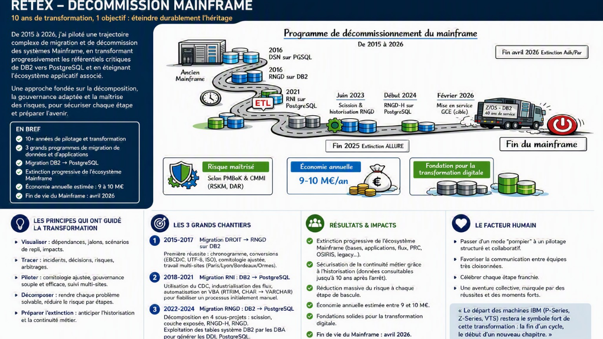

# RETEX – Décommissionnement du Mainframe

> **10 ans de transformation, un objectif : éteindre durablement l'héritage.**

## Résumé exécutif

Entre 2015 et 2026, j'ai contribué puis piloté plusieurs programmes successifs de migration et de transformation ayant conduit à l'extinction progressive d'un écosystème Mainframe historique.

L'objectif n'était pas de réaliser une simple migration technique. Il s'agissait de rendre possible l'arrêt d'un patrimoine critique tout en garantissant :

- la continuité métier ;
- la maîtrise des risques ;
- la conservation des données réglementaires ;
- la réduction des coûts d'exploitation ;
- la préparation de la transformation digitale.

Cette trajectoire a permis :

✔ la migration progressive des référentiels critiques DB2 vers PostgreSQL;

✔ l'extinction des composants Mainframe les plus sensibles ;

✔ la mise en place d'une stratégie d'historisation pérenne ;

✔ une économie annuelle estimée entre **9 et 10 M€** ;

✔ l'extinction définitive du Mainframe en **2026**.

---

# La trajectoire de transformation

## 2015 – 2017
### Migration DROIT vers RNGD (DB2)

Premier chantier structurant. Cette migration m'a permis de construire les premiers outils de pilotage qui serviront ensuite de modèle pour les programmes suivants :

- chronogramme industriel ;
- déroulement nominal + scénarios de repli ;
- annuaire des parties prenantes ;
- journal des incidents ;
- plan de communication.

### Défis techniques

Les données circulaient entre plusieurs environnements utilisant différents encodages : EBCDIC, UTF-8, ISO Latin.
Une durée de chargement de plusieur mois necessitant un chargement itiale ( date du pivot ) puis un rattrapage des delats sur trois mois.
Une orchestration avec les 9 SI formant les sources de données ( AG2R, Humanis, Klesia, ... ) 
Ce projet a constitué une première école de la gestion des migrations complexes et de la coordination multi-sites.

### Enseignement majeur

> Une gouvernance efficace s'ajuste comme le débit d'un robinet : suffisamment forte pour synchroniser les équipes, suffisamment légère pour ne pas les ralentir.

---

## 2018 – 2021
### Migration RNI : DB2 → PostgreSQL (2To) 

Deuxième grande étape de la trajectoire.

Le programme s'appuyait sur un mécanisme de :

**Change Data Capture (CDC)**

permettant de synchroniser progressivement les données entre DB2 et PostgreSQL.

### Difficultés rencontrées

Une partie du processus de generagtion des DDL reposait sur des traitements manuels qui généraient de nombreuses erreurs lors des itérations successives. Pour sécuriser la migration, j'ai développé des outils VBA permettant :

- d'automatiser certaines transformations ;
- d'ajouter les RTRIM nécessaires lors des conversions CHAR → VARCHAR.

### Enseignement majeur

> Tout traitement répétitif doit être industrialisé avant de devenir une source de risque.

---

## 2022 – 2024
### Migration RNGD : DB2 → PostgreSQL  (20 To) 

Cette phase constitue probablement le tournant du programme. L'analyse initiale montrait qu'une migration globale était trop risquée.
La solution retenue a été de décomposer le problème en plusieurs sous-projets autonomes.

### Lot 1 Scission de la base
Séparation entre :
- données actives ;
- données d'historisation.

### Lot 2 Migration de la couche exposée

Découplage des consommateurs de données.

### Lot 3 Migration RNGD-H

Migration du périmètre historique.

### Lot 4 Migration RNGD

Migration du cœur du référentiel.

### Facteur clé de réussite

L'automatisation des DDL PostgreSQL à partir des métadonnées DB2 a permis :

- une meilleure qualité ;
- moins d'erreurs ;
- une cadence de livraison supérieure.

L'emploie de deux solutions techniques CDC et HPU/BulkLoad pour la dizaine de tables les plus volumineuses.

### Enseignement majeur

> La décomposition transforme un problème complexe en une succession d'étapes pilotables.

---

## 2024 – 2026
### Historisation et extinction du Mainframe

L'un des paris les plus importants du programme a été la création d'une base dédiée à l'historisation.

Certaines données de recouvrement devaient rester consultables plusieurs années après l'arrêt des traitements historiques.

À l'époque, cette démarche ne faisait pas consensus.

Avec le recul, cette décision a constitué l'un des principaux facteurs ayant permis l'extinction définitive du système historique.

### Résultat

La consultation des données restant possible sur les nouvelles plateformes :

- les serveurs DB2 ont pu être arrêtés ;
- les métiers ont conservé l'accès à leur historique ;
- le risque opérationnel a été considérablement réduit.

### Enseignement majeur

> Préparer l'extinction commence plusieurs années avant la date d'arrêt.

---

# La méthode utilisée

Durant l'ensemble du programme, cinq principes ont guidé les décisions.

## Visualiser

Rendre visibles :

- dépendances ;
- jalons ;
- risques ;
- zones d'incertitude.

## Tracer

Conserver la mémoire opérationnelle :

- incidents ;
- arbitrages ;
- décisions ;
- plans de secours.

## Piloter

Adapter la gouvernance à la réalité du terrain :

- comitologie ajustée ;
- décisions courtes ;
- synchronisation régulière.

## Décomposer

Découper les transformations importantes en étapes successives :

- plus petites ;
- plus compréhensibles ;
- plus sécurisées.

## Préparer l'extinction

Anticiper très tôt :

- l'archivage ;
- l'historisation ;
- la continuité de service ;
- les besoins de consultation à long terme.

---

# Les résultats obtenus

## Risque maîtrisé

Une trajectoire construite selon les principes de gestion des risques :

- scénarios de repli ;
- décomposition progressive ;
- validation par étapes.

## Économie annuelle

Entre **9 et 10 M€ par an** grâce :

- à la réduction des coûts Mainframe ;
- à la simplification du patrimoine ;
- à la rationalisation des infrastructures.

## Fondation pour la transformation digitale

Les migrations ont permis :

- l'adoption de PostgreSQL ;
- la modernisation des interfaces ;
- la simplification des flux ;
- l'accélération des projets futurs.

---

# Le facteur humain

La réussite du programme n'est pas uniquement technique.

Elle repose également sur :

- la coopération entre équipes très silotées ;
- le travail multi-sites ;
- l'adaptation de la gouvernance ;
- la célébration des étapes importantes.

Passer progressivement d'un fonctionnement en mode "pompier" à un pilotage structuré a constitué l'un des apports majeurs de cette transformation.

Les moments de célébration ont joué un rôle essentiel dans la dynamique collective.

Parmi eux, le départ des dernières infrastructures IBM restera un souvenir marquant :

> La fin du Mainframe n'a pas été vécue comme la disparition d'une technologie, mais comme l'aboutissement d'une transformation préparée pendant plus de dix ans.

---

# Ce que cette expérience m'a appris

Cette trajectoire a confirmé plusieurs convictions :

- les grands programmes se pilotent par la visualisation ;
- la gouvernance doit être ajustée en permanence ;
- la décomposition réduit le risque ;
- l'automatisation augmente la qualité ;
- l'historisation est souvent la clé d'une extinction réussie.

Au final, le décommissionnement du Mainframe n'a pas été un projet d'arrêt.

Il a été un projet de transformation.

Et c'est précisément cette différence qui a permis sa réussite.

---

## Chiffres clés

| Indicateur | Valeur |
|------------|---------|
| Durée de la trajectoire | 2015 → 2026 |
| Grands programmes de migration | 3 |
| Technologies migrées | DB2 → PostgreSQL |
| Méthode de synchronisation | CDC |
| Économie annuelle estimée | 9 à 10 M€ |
| Date d'extinction du Mainframe | Avril 2026 |

---

> **Visualiser. Tracer. Piloter. Décomposer.**
>
> Les mêmes principes qui ont permis d'éteindre un Mainframe peuvent être appliqués à n'importe quel programme de transformation complexe.
